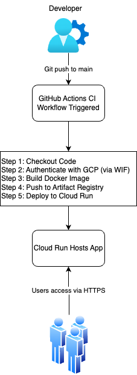
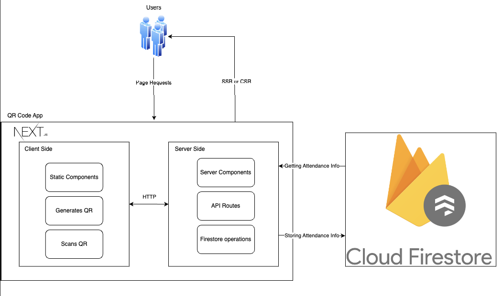

# QR Attendance Application
## Problem
The teacher of a class manually taking attendance can take up a major portion of class time. They have to go down a list one by one and call and listen for a response, this is both tedious and time consuming. The problems becomes more apparent if there is subsitute teacher, here they may not know where to find the class list, they may mispronounce names, etc., taking up even more class time.

## Our Solution
We created a digital and easy way to take attendance. A QR code based attendance system where teachers can generate a daily QR code which students can scan to mark that they are present.

## Service URL: 
https://qr-attendance-app-111147801991.us-central1.run.app

## Technical Details
### CICD and Deployment Diagram


### Architecture Diagram


## Running Locally
The application is in qr-attendance-app folder. Follow the following to run locally: 

Enter next.js app folder
```bash
cd qr-attendance-app
```
Download dependecies
```bash
npm install
```
Run development server 
```bash
npm run dev
# or
yarn dev
# or
pnpm dev
# or
bun dev
```
Open [http://localhost:3000](http://localhost:3000) with your browser to see the result.


## GCP Services we used 
1. GCP API, GCP secret manager (for OAuth)
2. AIM, Workforce Identity Federation (for CI/CD)
3. Cloud Run (for deployment)
4. Firestore (for database)
5. Artifact Registry (for images)


  
## Notes
When pushing a new revision to cloud run within github workflows it would not move all the traffice to the most recent revision:
```bash
gcloud run services update-traffic testservice --platform="managed" --to-latest
```
The command above makes it so you dont have to manually change the traffic.

### To update after changes:
gcloud builds submit --region us-central1 \
  --tag us-central1-docker.pkg.dev/cs1660-spring2025-mdn29/cloudrun/qr-attendance-app:v1

 gcloud run deploy qr-attendance-app \      
  --allow-unauthenticated \                                                             
  --image us-central1-docker.pkg.dev/cs1660-spring2025-mdn29/cloudrun/qr-attendance-app:v1 \
  --service-account cloudrun@cs1660-spring2025-mdn29.iam.gserviceaccount.com \
  --region us-central1 \
  --port 3000
